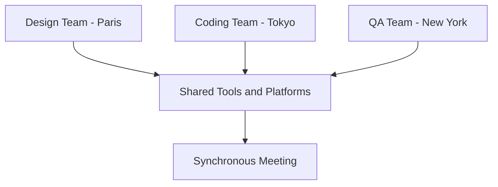

## Why I Champion the Async-First Approach

As someone who appreciates the nuances of team communication and collaboration, I've always leaned towards an "async-first" model. But why?

### The Merits of Async-First

1. **Respect for Diversity**: Asynchronous communication respects everyone's rhythm, timezone, and culture, promoting a more inclusive workspace.
2. **Enhanced Focus and Productivity**: It offers periods of deep work without the constant interruptions that synchronous communication can sometimes bring.
3. **Greater Autonomy**: It allows team members the freedom to manage their schedules more effectively, leading to improved work-life balance.

### Sync-First: Not My Cup of Tea

While synchronous communication has its merits, especially in terms of instant feedback, the challenges it brings can't be ignored:

- **Time Drain**: Continuous real-time interaction often leaves less room for focused individual work.
- **Restricted Flexibility**: Synchronous communication can be challenging for teams spread across different time zones.
- **Risk of Burnout**: A continuous barrage of real-time interactions can lead to mental exhaustion.

### Real-World Scenario: International Collaboration

Let's take a tech startup with teams across the globe:

- The design team in Paris
- The coding team in Tokyo
- The QA team in New York

With different time zones, asynchronous communication becomes a lifeline. Periodic synchronous meetings, however, ensure alignment and foster team cohesion.

## The Perils of Extremes: Why Async-Only and Sync-Only Falter

In the grand orchestra of team communication, harmony is crucial. Swinging too far in either direction—fully asynchronous or fully synchronous—can lead to dissonance.

### Downsides of Async-Only:

1. **Delayed Feedback**: Critical decisions might be postponed due to the lack of real-time interaction.
2. **Potential Isolation**: Team members might feel detached, leading to a sense of alienation and reduced team cohesion.
3. **Missed Nuances**: Written communication, though clear, may sometimes miss out on the subtleties and emotional cues present in direct conversations.

### Pitfalls of Sync-Only:

1. **Interrupted Flow**: Constant real-time interactions can disrupt the flow, impeding deep work and concentration.
2. **Logistical Nightmares**: Coordinating synchronous activities across time zones can be a challenge, often leading to inefficiencies.
3. **Burnout Catalyst**: Continuous engagement without breaks can accelerate mental fatigue and burnout.

### Key Insight:

While both models offer unique advantages, an extreme adherence to either can be detrimental. It's akin to having only one tool in your toolkit—limiting and ineffective. A blended approach, customized to the team's needs and the project's demands, invariably produces the most harmonious tunes.

## Striking the Right Balance

While I'm a strong proponent of async-first, I acknowledge the need for synchronous interactions. The sweet spot? A dynamic balance that leans heavily towards asynchronous work.

### The Ideal Async-Sync Spectrum

1. **Flexibility is Key**: While a 100% async model might be too rigid, a balance between 50-99% async and 1-50% sync often proves most effective.
2. **Customization Over Prescription**: Different teams and projects might require varying balances, emphasizing the need for adaptability and periodic reflection.

## Special Cases: Embracing Exceptions in an Async-First World

While the merits of an async-first approach are clear, it's equally important to acknowledge that not all scenarios—or individuals—fit neatly within its confines. The ebb and flow of work dynamics necessitate that we remain sensitive to these special cases and create room for them within our broader framework.

### Individual Needs and Preferences:

1. **Silent Thinkers**: Some people naturally require more silent introspection or dedicated focus time, especially when grappling with complex issues. Respecting these periods ensures that they can achieve their best work.
2. **Combatting Isolation**: Remote work, while offering numerous benefits, can sometimes lead to feelings of isolation. For those seeking more social interactions, periodic synchronous interactions or virtual "coffee breaks" can be a lifeline.
3. **Mood and Mental Health**: Our mental state can greatly influence our preference for communication. Some days might call for more solitude, while others might necessitate the energy of group interactions.

### Task-Based Considerations:

1. **Workshops**: Activities such as brainstorming sessions or strategy workshops often thrive on real-time interactions, where spontaneous ideas and rapid feedback create a synergistic effect.
2. **Project Kick-offs and Bootstrapping**: The initial phases of projects can benefit from synchronous alignment, ensuring that everyone is on the same page from the get-go.
3. **Troubleshooting and Pair Programming**: Some tasks, like debugging a critical issue or coding in tandem, gain immensely from real-time collaboration, where immediate feedback can accelerate resolution.

### Key Takeaway:

While the default should be a flexible async-first approach, it's pivotal to remain adaptable. By recognizing these special cases and keeping the door open for them, we ensure a holistic work environment. The goal isn't rigidity but rather fostering a culture where individuals feel empowered to voice their needs. And while the broader async rhythm forms the backbone, these exceptions enrich the symphony, making it fuller and more inclusive.

## Conclusion

For me, an async-first approach, complemented by strategic synchronous interactions, offers the best of both worlds. It combines the depth and focus of asynchronous work with the clarity and immediacy of synchronous communication. Yet, understanding that exceptions exist, and embracing them with openness, only strengthens this approach. Finding the right balance, staying adaptable, and continuously recalibrating is the secret to an efficient and harmonious work environment.
