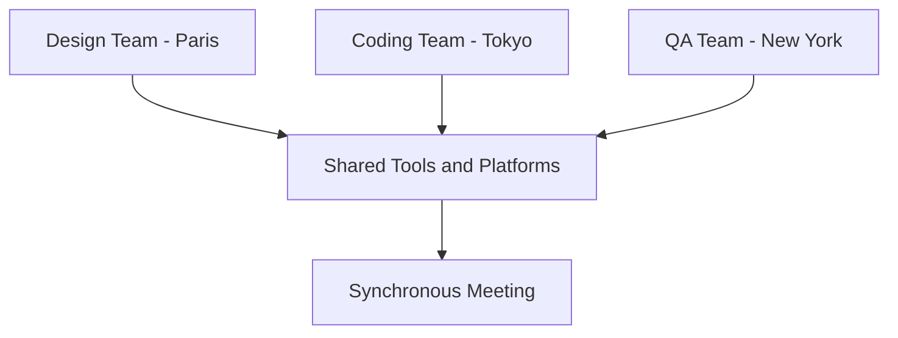

## Why I Champion the Async-First Approach

As someone who appreciates the nuances of team communication and collaboration, I've always leaned towards an "async-first" model. But why?

### The Merits of Async-First

1. **Respect for Diversity**: Asynchronous communication respects everyone's rhythm, timezone, and culture, promoting a more inclusive workspace.
2. **Enhanced Focus and Productivity**: It offers periods of deep work without the constant interruptions that synchronous communication can sometimes bring.
3. **Greater Autonomy**: It allows team members the freedom to manage their schedules more effectively, leading to improved work-life balance.

### Sync-First: Not My Cup of Tea

While synchronous communication has its merits, especially in terms of instant feedback, the challenges it brings can't be ignored:

- **Time Drain**: Continuous real-time interaction often leaves less room for focused individual work.
- **Restricted Flexibility**: Synchronous communication can be challenging for teams spread across different time zones.
- **Risk of Burnout**: A continuous barrage of real-time interactions can lead to mental exhaustion.

### Real-World Scenario: International Collaboration

Let's take a tech startup with teams across the globe:

- The design team in Paris
- The coding team in Tokyo
- The QA team in New York

With different time zones, asynchronous communication becomes a lifeline. Periodic synchronous meetings, however, ensure alignment and foster team cohesion.

## Striking the Right Balance

While I'm a strong proponent of async-first, I acknowledge the need for synchronous interactions. The sweet spot? A dynamic balance that leans heavily towards asynchronous work.

### The Ideal Async-Sync Spectrum

1. **Flexibility is Key**: While a 100% async model might be too rigid, a balance between 50-99% async and 1-50% sync often proves most effective.
2. **Customization Over Prescription**: Different teams and projects might require varying balances, emphasizing the need for adaptability and periodic reflection.

## Conclusion

For me, an async-first approach, complemented by strategic synchronous interactions, offers the best of both worlds. It combines the depth and focus of asynchronous work with the clarity and immediacy of synchronous communication. Finding the right balance and continuously recalibrating is the secret to an efficient and harmonious work environment.
