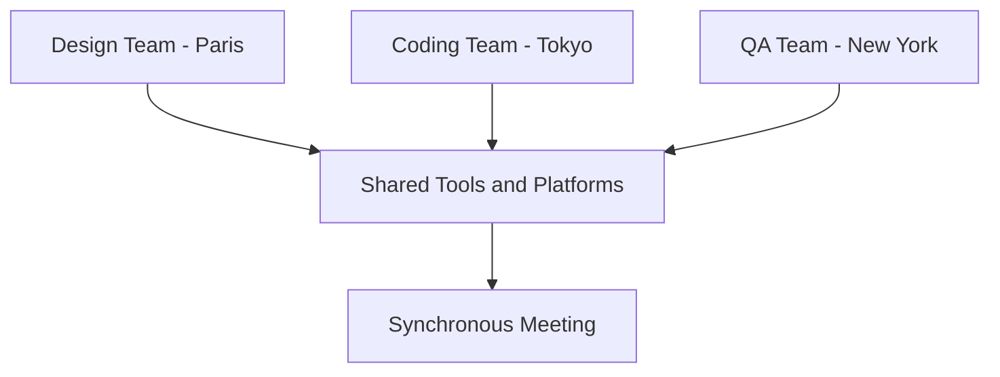

While I firmly believe in the superiority of the async-first approach, it's crucial not to get dogmatic about it. Here's why: any methodology, when applied too rigidly, can become its own kind of trap. The essence of "async" is flexibility. To be truly flexible, we need to allow for some degree of synchronous communication when the situation demands it.

To understand this better, let's consider an example:

## Real-World Scenario: International Collaboration

Imagine a tech startup with teams distributed across the globe: 

- The design team is based in Paris
- The coding team operates out of Tokyo
- The QA team is stationed in New York

Given the different time zones, asynchronous communication using shared tools and platforms becomes indispensable. The design team sends over the latest UI mockups using a shared platform. The coding team, waking up hours later, accesses these designs, starts its development work, and pushes updates. The QA team, in yet another time zone, picks up from where the coding team left, tests the new features, and logs any issues.

However, once in a while, a synchronous meeting is organized to ensure everyone is aligned, to discuss any pressing issues, and to foster team cohesion. This real-time interaction complements the asynchronous workflow, making the collaboration richer and more effective.

---

This combination of predominantly asynchronous work with strategic synchronous touchpoints represents the ideal. It's about finding that sweet spot – the optimal blend of async-first with just the right amount of sync to enhance, not hinder, the workflow.
