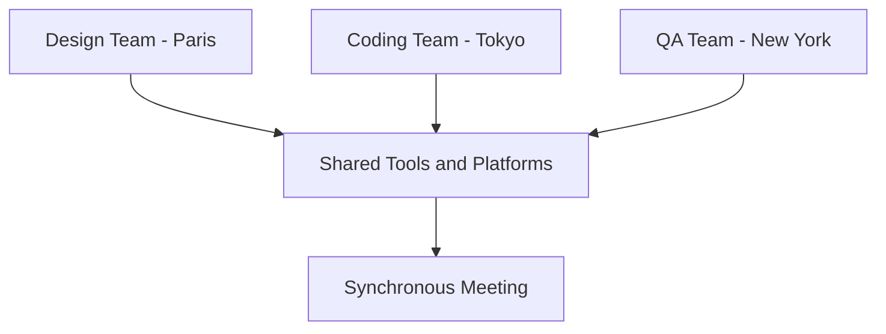

Dive deep into the async-first approach, exploring its harmonious relationship with synchronous interactions, and embark on a journey through my personal experiences and reflections.

## The Async-First Appeal

Team dynamics and the art of collaboration have fascinated me for years. After much observation and introspection, the async-first model emerges as my go-to. Let’s dive into the reasons.

### Strengths of Asynchronous Communication:

1. **Embracing Diversity**: Asynchronous communication is a salute to individual rhythms, time zones, and cultural backgrounds, fostering a truly inclusive workspace.
2. **Deep Work**: Minimized interruptions translate to enhanced focus and productivity.
3. **Autonomy Galore**: Team members have the liberty to craft their schedules, enhancing work-life harmony.

### The Synchronous Struggle:

Real-time communication isn't all bad—it's a powerful tool for instant feedback. However, it does come bundled with its own challenges:

- **Time Vampires**: The lure of real-time chats often overshadows valuable, focused work.
- **Time Zone Tug-of-War**: Juggling different time zones? It’s no walk in the park.
- **Burnout Lurks**: An unending stream of interactions can be mentally taxing.

Consider a scenario in a global tech startup:

- Designers nestled in Paris
- Coders bustling in Tokyo
- QA specialists anchored in New York

Different time zones naturally push for an async approach. However, periodic sync-ups ensure the alignment and harmony of the team’s goals.

---

## Treading the Extreme Paths: Async-Only vs. Sync-Only

Every dance requires balance, and the rhythm of team communication is no different. Let’s spotlight why extremes can be tricky.

### When Async Goes Overboard:

1. **The Waiting Game**: Vital decisions might linger in limbo without real-time discussions.
2. **Isolation Creeps In**: Purely written exchanges risk leaving team members feeling adrift.
3. **Lost in Translation**: The warmth and nuances of face-to-face interactions often get overlooked.

### The Sync Slippery Slope:

1. **Broken Rhythms**: Persistent interruptions hamper concentration.
2. **Scheduling Nightmares**: Synchronizing global teams in real-time? Herculean.
3. **Mental Drain**: Continuous engagement without respite is a recipe for fatigue.

A balanced approach, tailored to a team's tempo and project requirements, strikes the best chord.

---

## The Art of Balancing

Championing async-first doesn’t mean sidelining synchronous interactions. It's all about the delicate dance of equilibrium.

### Async-Sync Spectrum Insights:

1. **Dynamic Balance**: Whether it's an 80/20, 70/30, or any other ratio, the key lies in flexibility and the ability to adapt. While a 100% async model can feel stiff, a judicious mix of mostly async with sprinklings of sync often yields the most productive results.
2. **One Size Doesn't Fit All**: Every team, every project is unique. The key is to adapt and revisit the balance often.

---

## Navigating Exceptions in the Async Landscape

The power of the async-first approach is undeniable. However, being aware of its exceptions and nuances only strengthens its foundation.

### Individual Preferences:

1. **Introspective Moments**: There are times when silence is golden—like when dissecting complex issues. Respecting this need can transform outcomes.
2. **Bridging the Isolation Gap**: The solitude of remote work can be double-edged. Occasional virtual coffee breaks or casual sync-ups can work wonders.
3. **Mindset Matters**: Some days might lean towards solitude, while others yearn for interaction. Fluidity in communication accommodates these shifts.

### Task-driven Variations:

1. **Brainstorming Bonanza**: Interactive sessions like workshops thrive on live feedback.
2. **Project Inceptions**: Launching a new project? An initial sync-up ensures everyone's in sync.
3. **Troubleshooting Together**: Tasks like pair programming or live debugging? Sometimes, two real-time brains work better than one.

While the bedrock of our collaboration is async-first, these exceptions add valuable nuances.

---

## Parting Thoughts

For me, the blend of asynchronous depth enriched with the zest of synchronous interactions forms the ideal tapestry of team communication. Recognizing the exceptions and adapting enriches the canvas. By
