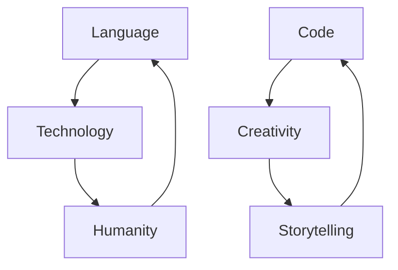

In the realm of programming, where ones and zeroes choreograph digital symphonies, we uncover a world beyond binary. Technology shapes our reality, bridging machines and humanity with a profound truth: the language of technology is a bridge itself.

## Language's Evolution: From Cuneiform to Code

Language has always been our guide, shaping cultures and stories since the days of cuneiform and hieroglyphics. Today, programming languages emerge as catalysts, propelling innovation and evolution.

## Code's Convergence: Where Logic Meets Language

Programming languages, born from efficiency and precision, mirror our pursuit of harmony. From assembly languages to high-level counterparts, this evolution fuels creations like machine learning algorithms that decode patterns beyond human grasp.

## Code and Culture: Beyond Binary, Into Humanity

Code is culture, transcending binary bounds. It spans a spectrum from ["The Classic Hello"](./posts/hello.md) to ["The Essence of Open Source"](./posts/open-bar.md), revealing that it's not just about functions or classes but the people behind them and the culture they foster. ["Open Source Culture Beyond Code"](./posts/open-culture.md) highlights this, emphasizing the importance of community and collaboration. Merging tech strategy and inclusivity principles, the soul of coding goes beyond algorithms.

## Dance of Humans and Compilers

Compilers, like us, translate intent into action. They convert human-readable code into machine instructions, much like humans translate thoughts into language. Mistakes in code mirror misunderstandings among humans, yielding unintended outcomes.

## Code as Symphony: A Tapestry of Creativity

Imagine viewing code as art, not just a tool. Programming languages, especially interpreted ones, turn coding into storytelling and poetry. A synthesis that welcomes all, it challenges the notion that code is just for teams and binaries for users.

## Language: Reflections of Humanity

Code is a dialogue reflecting our shared humanity, dreams, and curiosity. Just as language propelled us through history, code propels us into the digital age.

* *"Language shapes thoughts; code shapes the realms we create."*
* *"Code is a symphony of human ingenuity, each line resonating with aspirations."*

## Empowering Language Through History

History showcases language's might:

1. **Cuneiform and Hieroglyphics (Ancient Times):** The earliest code that bridged generations.
2. **Gutenberg Printing Press (15th Century):** Language fueled the Renaissance, reshaping knowledge sharing.

Imagine harnessing language again today to unite us in addressing challenges, just as history's shifts did. Language continues its powerful role in shaping our destiny.

## Schemas and Quotes

Here's a thought-provoking schema to ponder:

As you journey into the intersection of technology and humanity, remember: code and language are your guideposts in this digital odyssey.

"The digital age is driven by language, shaping both the tools we create and the futures we envision." - Jane Smith
