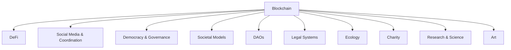

Blockchains, since their inception, have been hailed as revolutionary, with the potential to redefine the very fabric of our societal systems. Unfortunately, the conversation surrounding this technology has often been reduced to its applications in Decentralized Finance (DeFi). While DeFi undoubtedly offers a tantalizing promise of democratizing finance, it's crucial to recognize that blockchains can - and should - be used for much more.

## The Overemphasis on DeFi

"*To every age, a relic of its time. Our age? The blockchain.*" - Anonymous

DeFi has garnered a lion's share of the attention in the blockchain world. The decentralized financial tools have transformed how we view banking, lending, and trading. However, constraining blockchain's potential to just DeFi is akin to using a powerful computer solely for basic arithmetic - it's a diminutive use of its vast potential.

## The Broader Horizon

Blockchain can be the linchpin in addressing challenges in numerous sectors:

- **Social Coordination & Media:** Imagine a world where news, data, and information are transparently and immutably stored, reducing misinformation.
- **Democracy & Governance:** Voter fraud, opaque decision-making processes, and bureaucratic delays can be things of the past.
- **Societal Models & Cooperatives:** We can forge new organizational structures where power dynamics are decentralized.
- **DAOs:** Decentralized Autonomous Organizations can redefine organizational governance without intermediaries.
- **Legal Systems:** Transparent, immutable ledgers can revolutionize the way we understand contracts and rights.
- **Ecology:** Traceable carbon footprints, transparent pollution data, and more can be achieved with blockchain.
- **Charity:** Donations can be tracked transparently, ensuring they reach their intended beneficiaries.
- **Research & Science:** Authenticity in research papers, data collection, and peer reviews can be maintained.
- **Art:** Provenance tracking, royalty distributions, and artist recognition can be transformed using blockchain.

## Challenges Ahead

1. **Education & Awareness:** Moving the conversation from just DeFi to the broader applications of blockchain.
2. **Scalability:** Ensuring blockchain solutions can handle the demands of global applications.
3. **Interoperability:** Making different blockchain systems work seamlessly with each other.
4. **Regulation:** Constructive regulatory frameworks that do not stifle innovation.
5. **Usability:** Building user-friendly applications to encourage adoption.

## Conclusion

"*The blockchain is more than a technology. It’s a movement.*" - Don Tapscott

While DeFi has paved a prominent path in the blockchain journey, the destination is far from reached. The canvas is vast, and it's up to innovators, thinkers, and dreamers to paint a future where blockchain becomes synonymous not just with finance, but with a decentralized, transparent, and just world. It's high time we expanded our horizons and delved into the multifaceted marvels blockchain promises to the world beyond DeFi.
