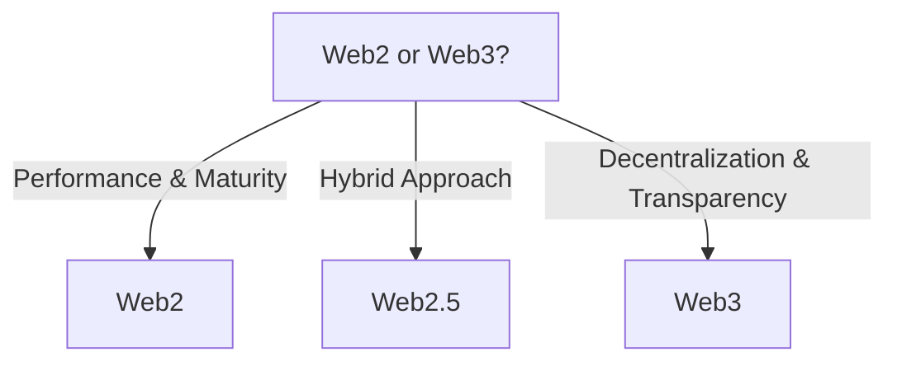

**Blockchains** have consistently been at the forefront of discussions about disruptive technologies. Yet, a disproportionate focus on Decentralized Finance (DeFi) often overshadows its vast array of applications. While DeFi plays a pivotal role in democratizing finance, the true essence of blockchain's potential sprawls across myriad sectors.

## Why the Spotlight on DeFi?

DeFi has, undoubtedly, been the star of the blockchain show. Its transformative power has reimagined banking, lending, and trading systems. Yet, it's important to remember: limiting blockchain's horizon to DeFi is akin to using the Hubble Telescope to peer into our backyard – there's so much more to explore.

> "If I had asked people what they wanted, they would have said faster horses." - Henry Ford

## A Pervasive Future of Blockchain

In the tapestry of tomorrow, blockchains will be interwoven into our daily lives, permeating every facet of human interaction. The image of today's typical blockchain user — often perceived as a tech-savvy enthusiast or a privileged investor — will shift dramatically. Blockchains will become as ubiquitous as the internet, and their interfaces will evolve to cater to everyone, regardless of their technical prowess or socio-economic background. The user experience (UX) will undergo a metamorphosis, making blockchain-driven applications as intuitive and user-friendly as today's mainstream web platforms.

> "There is nothing more powerful than an idea whose time has come." - Victor Hugo

## The Developer's Crossroads: Web2 vs. Web3

The horizon holds promise for developers too. The day isn't far when a developer, starting a new project, will be at a crossroads — choosing between Web2 and Web3 technologies. This choice will not be dictated by technological superiority but by the application's intrinsic needs. Does the project demand decentralization, unparalleled transparency, and inherent trust? Web3 beckons. Does it require raw performance and the maturity of existing frameworks? Web2 remains relevant.

In essence, it's the context and not the convention that will guide technological adoption. And as these technologies mature, I eagerly await the rise of "web2.5" — hybrid applications that harness the best of both worlds, bridging the decentralized with the centralized, crafting solutions that were once deemed unfathomable.

## Blockchain: A Bulwark Against The Rise of AI

As artificial intelligence (AI) advances, its ubiquity and influence in our daily lives grow. While AI holds the promise of optimization and efficiency, unchecked and unchallenged, it might also centralize control, putting vast power into the hands of a select few. Herein lies one of the profound promises of blockchain technology.

In my opinion, blockchains represent more than just a technical marvel. They stand as a testament to a decentralized future, where power and control are distributed, not hoarded. By embedding crucial systems and processes within a decentralized framework like blockchain, we could harness the power of AI while ensuring it remains a tool for humanity — not our overlord.

Web3, in essence, isn't just a technological shift; it's a paradigm shift. It's our answer to preserving the autonomy and agency of individual world citizens in the face of behemoth conglomerates and powerful technological forces.

> "Liberty, when it begins to take root, is a plant of rapid growth." - George Washington

## Exploring the Larger Landscape

The transformative power of blockchain extends to:

- **Social Coordination & Media:** Envision transparent, immutable archives of information, effectively curbing misinformation.
- **Democracy & Governance:** A future without voter fraud, bureaucratic snags, or hidden decision-making processes.
- **Societal Models & Cooperatives:** Pioneering decentralized structures that recalibrate power dynamics.
- **DAOs:** Charting the future of organization without middlemen.
- **Legal Systems:** Reshaping our understanding of contracts and rights with transparent ledgers.
- **Ecology:** Harnessing traceable carbon footprints and pollution metrics.
- **Charity:** Ensuring every donated dollar reaches its destination transparently.
- **Research & Science:** Reinforcing authenticity in academia and research.

> "The best way to predict the future is to invent it." - Alan Kay

## Uniting the World: The Global Blockchain Web

With advancements in UX, developer experiences (DX), and the confluence of hybrid applications, the stage is set for blockchain to not just power applications but to drive world-sized platforms. Breaking down geographical barriers and cultural frontiers, these platforms will herald a new era of global unity and interconnectivity.

Yet, amid this vastness, the true beauty, I believe, will emerge from the nuances. Imagine a future dotted with countless micro blockchains, each tailored to the unique needs of smaller cultural or geographical communities. Like the vibrant cities of our world, each with its distinct flavor but interconnected by roads, these blockchains will form a colossal, virtual meta-network. This network will celebrate both the individuality of its parts and the unity of its whole.

> "We build too many walls and not enough bridges." - Sir Isaac Newton

## Final Thoughts

The DeFi phenomenon is just one chapter in blockchain's grand narrative. A boundless expanse lies ahead, awaiting pioneers to weave a future where blockchain symbolizes more than just finance – it stands for a decentralized, lucid, and equitable globe. It's imperative we broaden our vistas and immerse ourselves in the manifold wonders that blockchain promises beyond the realm of DeFi.
