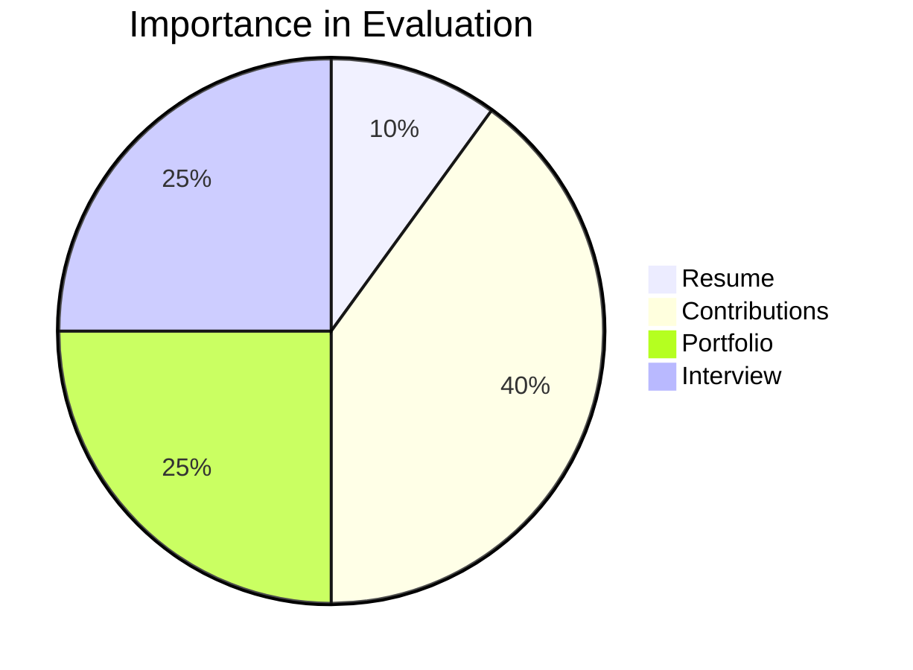

## The Compatibility Conundrum

When it comes to meeting candidates for hiring, consulting, or collaboration, relying solely on a resume can be limiting. In this blog post, we'll explore the significance of contributions and how they can serve as a more reliable indicator of compatibility.

### The Risk of No Fit

Candidates who come with a CV but no tangible contributions may pose a higher risk of not being a good fit. Without any demonstrated work or involvement, it becomes challenging to assess their compatibility with the project or organization.

> "Action speaks louder than words but not nearly as often." - Mark Twain

It's not enough to have a well-crafted resume; candidates need to show their ability to contribute and make a meaningful impact.

### The Pitfall of Company Expertise

Candidates who have spent a long time working in one company may become highly specialized in that specific environment. While this may seem impressive, it can also mean they have limited experience outside of that particular setting. It's important to consider candidates who have a broader range of experiences to ensure they can adapt to different situations.

However, it's worth noting that open-source contributions and portfolios can be valuable even for those who are young or have limited professional experience. These opportunities allow you to showcase your skills, enthusiasm, and potential fit for a role or project. Even as a student, you can make a positive impression by demonstrating your compatibility, enthusiasm, and ability to contribute. These contributions can provide evidence of your abilities and make a strong case for your fit within a particular organization or project.

Remember, age and experience are not the only factors that determine compatibility and suitability. Open-source contributions, portfolios, and the ability to showcase your enthusiasm and potential can make a significant impact in highlighting your fit for a role or project, regardless of your level of experience.

### The Fear Factor

Candidates who have stayed in one company for an extended period may be hesitant to take risks or explore new opportunities. It's essential to find candidates who are open to change and willing to embrace new challenges.

> "The only way to grow is to step out of your comfort zone and embrace new challenges. Stagnation is the enemy of progress." - John Doe

### The Power of Portfolios

Portfolios are more than just a collection of previous works; they represent the journey of a professional, showcasing their growth, learning, and adaptability. Both professional and personal portfolios offer valuable insights into a candidate's style, thought process, and capabilities. They are like windows into their professional world, providing prospective employers or collaborators with a deeper understanding of what the candidate brings to the table.

A **professional portfolio** often contains a curated selection of the candidate's best works. It may include projects they've completed, designs they've created, or software they've developed. This gives an overview of their proficiency, attention to detail, and their ability to handle complex tasks. It also highlights their growth over time, showing how they've tackled different challenges and evolved in their role.

On the other hand, **personal portfolios** give a glimpse into a candidate's passion, hobbies, and side projects. These can be equally illuminating. They often reveal a candidate's self-driven initiatives, their willingness to explore beyond work settings, and the personal interests that drive them. For instance, a software developer's personal portfolio might contain apps they've built in their free time, revealing their passion for solving particular problems or using specific technologies. Similarly, a designer might have a collection of artwork, photographs, or personal design projects that showcase their unique style and perspective.

When reviewing a portfolio, it's not just about the end product. It's about understanding the process, the decisions made along the way, and the reasoning behind them. By diving deep into a candidate's portfolio, you can understand their problem-solving capabilities, their design thinking, or their approach to coding challenges.

Moreover, portfolios can bridge the gap between theoretical knowledge and practical application. While a resume might indicate that a candidate knows a particular software or tool, their portfolio shows how they've applied that knowledge, offering tangible proof of their expertise.

In today's digital age, it's easier than ever for candidates to create online portfolios, providing interactive and engaging experiences for viewers. Platforms like Behance, GitHub, and Dribbble allow professionals from various fields to showcase their works, receive feedback, and continuously refine their portfolios. These platforms also foster communities where like-minded professionals can collaborate, learn, and grow together.

In essence, portfolios offer a more comprehensive, multi-dimensional view of a candidate, enabling employers and collaborators to make informed decisions. It's not just about what a candidate can do, but how they do it, and what drives them. As such, portfolios play a pivotal role in assessing compatibility and ensuring a harmonious collaboration.

> "The portfolio is the new resume." - Timothy Ferriss

### Contributions as a Portfolio

Now, let's discuss the true MVPs – candidates who bring tangible contributions to the table. It's akin to having a wide array of options at your disposal. These contributions act as the secret ingredient that enhances the flavor of your project or organization. They showcase a candidate's ability to work effectively and make a significant impact. It's comparable to having a skilled chef who brings their own unique recipe – a recipe for success.

When I meet someone who has made an initial attempt at contributing, it's like finding a hidden treasure. It's an implicit proof of compatibility between my project and the person, like two puzzle pieces that fit perfectly together. We can dive into the nitty-gritty details and have more meaningful discussions. These candidates tend to ask insightful questions, showing a better understanding of the project and a genuine interest in its future.

To encourage contributions, various approaches can be taken. Open-source contributions allow candidates to showcase their skills and compatibility. Technical tests, whether paid or not, can also provide valuable insights. It's important to tailor these tests to closely resemble the actual work the candidate would be doing if hired.

> "The contribution is the new portfolio." - Me :)

## Embracing Compatibility for Success

In conclusion, when evaluating candidates, it's crucial to look beyond the traditional resume and consider their contributions. Tangible contributions provide evidence of compatibility and demonstrate a candidate's ability to make a meaningful impact. By emphasizing contributions and considering both professional and personal portfolios, we can find the perfect fit and create successful collaborations.

Remember, actions speak louder than words when it comes to compatibility.

> "It's not enough to have a dream, unless you're willing to pursue it." - Walt Disney
