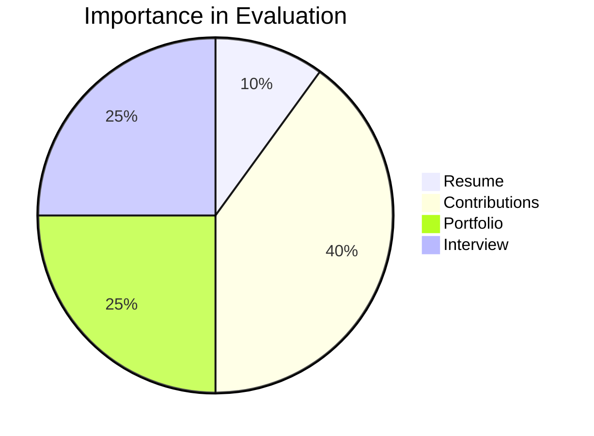

How I Assess Compatibility in Hiring and Collaboration.

## The Compatibility Conundrum

When it comes to meeting candidates for hiring, consulting, or collaboration, relying solely on a resume can be limiting. In this blog post, we'll explore the significance of contributions and how they can serve as a more reliable indicator of compatibility.

Compatibility is like a dance. Both parties need to be in sync for it to work. While a resume might provide a snapshot of an individual's educational background and experience, it may not capture their rhythm, their ability to adapt to new tunes, or their passion for the dance itself.

### The Risk of No Fit

Candidates who come with a CV but no tangible contributions may pose a higher risk of not being a good fit. Without any demonstrated work or involvement, it becomes challenging to assess their compatibility with the project or organization.

> "Action speaks louder than words but not nearly as often." - Mark Twain

It's not enough to have a well-crafted resume; candidates need to show their ability to contribute and make a meaningful impact. A resume might tell you about a candidate's past, but their contributions will give you a glimpse into their future potential and how they might fit into your organization's ecosystem.

### The Pitfall of Company Expertise

Candidates who have spent a long time working in one company may become highly specialized in that specific environment. While this may seem impressive, it can also mean they have limited experience outside of that particular setting. When they step outside of their familiar territory, how well can they adapt? Will they be able to dance to a different tune?

It's important to consider candidates who have a broader range of experiences to ensure they can adapt to different situations. Diversity in experience can translate to adaptability, innovative thinking, and a fresh perspective, all crucial elements for the growth and sustainability of any organization or project.

However, it's worth noting that open-source contributions and portfolios can be valuable even for those who are young or have limited professional experience. These opportunities allow you to showcase your skills, enthusiasm, and potential fit for a role or project. Even as a student, you can make a positive impression by demonstrating your compatibility, enthusiasm, and ability to contribute. These contributions can provide evidence of your abilities and make a strong case for your fit within a particular organization or project.

Remember, age and experience are not the only factors that determine compatibility and suitability. Open-source contributions, portfolios, and the ability to showcase your enthusiasm and potential can make a significant impact in highlighting your fit for a role or project, regardless of your level of experience.

### The Puzzling Nature of Resumes

Resumes are, in essence, a candidate's pitch. They're crafted, tailored, and often optimized to resonate with potential employers. However, this tailored approach sometimes results in a narrative that might lean heavily on what the candidate perceives an employer wants to hear. The resume can occasionally be marketed on aspects that might not even be entirely relevant or might gloss over potential pitfalls. 

> "A resume is like a mirror that only reflects what you want it to show."

This isn't to say that all resumes are misleading. Many are genuine, transparent, and truly representative of a candidate's capabilities. But the inherent nature of a resume allows for this potential discrepancy between presentation and reality. 

Certainly. It's essential to discuss both ends of the spectrum when it comes to how resumes can be presented. Let's delve deeper into the intricacies of undersold resumes:

### The Dual Edges of Resumes

While we've delved into the potential for overselling within resumes, there's an equally significant but less-discussed challenge: the undersold resume. Many talented individuals might not be adept at marketing themselves. Whether due to modesty, a lack of confidence, imposter syndrome, or simply an introverted nature, their resumes may not shout their accomplishments from the rooftops. 

**Imposter Syndrome:** This is a pervasive feeling that you're not as competent as others perceive you to be. Those with imposter syndrome often believe they've only got where they are through luck and not because of their talents or qualifications. Such individuals might downplay their achievements, fearing they'll be exposed as frauds.

**Introversion:** Being introverted doesn't equate to a lack of skill or ability. However, introverts might not feel as comfortable "selling" themselves or might believe their work should speak for itself. This nature can lead to muted resumes that don't fully encapsulate their capabilities.

This understated presentation can be detrimental. Recruiters or potential collaborators may overlook these candidates, missing out on the immense value they can bring to the table. 

### Contributions: The Level Playing Field

Where resumes might falter due to personal inhibitions, contributions emerge as a savior. A contribution doesn't discriminate based on the loudness of one's voice but purely on the merit of the work. Whether you're an extrovert who's confident in your abilities or an introvert with bouts of imposter syndrome, your contribution remains unchanged and stands testament to your skills.

In this realm, actions truly speak louder than words, or in this case, louder than the volume at which one is comfortable discussing their achievements.

> "In the world of contributions, the work is the voice that resonates."

### Contributions: The Unfiltered View

In stark contrast, a contribution is just that - a contribution. It stands as a testament to what a person has done, often in an unfiltered and genuine manner. When a candidate contributes to a project, they leave behind tangible evidence of their work, be it code, designs, documentation, or any other form of participation. 

This raw, unfiltered view offers reviewers the opportunity to see the candidate's work in its true form. They can assess the quality, dedication, and depth of thought that went into the contribution. Moreover, it's up to the reviewer to extract the details that are most relevant to their needs. 

> "Contributions stand as monuments of authenticity in a world crowded with facades."

However, it's worth noting that not everyone has had the opportunity or platform to make notable contributions. This is a challenge and a risk in assessing compatibility. But, I remain hopeful that this paradigm will shift. As our world becomes more collaborative and interconnected, the value of contributions, even on school projects or minor hobby initiatives, will become more evident. These contributions, no matter how small, can shed light on an individual's character, work ethic, and passion.

### The Fear Factor

Candidates who have stayed in one company for an extended period may be hesitant to take risks or explore new opportunities. It's essential to find candidates who are open to change and willing to embrace new challenges.

> "The only way to grow is to step out of your comfort zone and embrace new challenges. Stagnation is the enemy of progress." - John Doe

## The Power of Portfolios

Portfolios are more than just a collection of previous works; they represent the journey of a professional, showcasing their growth, learning, and adaptability. Both professional and personal portfolios offer valuable insights into a candidate's style, thought process, and capabilities. They are like windows into their professional world, providing prospective employers or collaborators with a deeper understanding of what the candidate brings to the table.

A **professional portfolio** often contains a curated selection of the candidate's best works. It may include projects they've completed, designs they've created, or software they've developed. This gives an overview of their proficiency, attention to detail, and their ability to handle complex tasks. It also highlights their growth over time, showing how they've tackled different challenges and evolved in their role.

On the other hand, **personal portfolios** give a glimpse into a candidate's passion, hobbies, and side projects. These can be equally illuminating. They often reveal a candidate's self-driven initiatives, their willingness to explore beyond work settings, and the personal interests that drive them. For instance, a software developer's personal portfolio might contain apps they've built in their free time, revealing their passion for solving particular problems or using specific technologies. Similarly, a designer might have a collection of artwork, photographs, or personal design projects that showcase their unique style and perspective.

When reviewing a portfolio, it's not just about the end product. It's about understanding the process, the decisions made along the way, and the reasoning behind them. By diving deep into a candidate's portfolio, you can understand their problem-solving capabilities, their design thinking, or their approach to coding challenges.

Moreover, portfolios can bridge the gap between theoretical knowledge and practical application. While a resume might indicate that a candidate knows a particular software or tool, their portfolio shows how they've applied that knowledge, offering tangible proof of their expertise.

In today's digital age, it's easier than ever for candidates to create online portfolios, providing interactive and engaging experiences for viewers. Platforms like Behance, GitHub, and Dribbble allow professionals from various fields to showcase their works, receive feedback, and continuously refine their portfolios. These platforms also foster communities where like-minded professionals can collaborate, learn, and grow together.

In essence, portfolios offer a more comprehensive, multi-dimensional view of a candidate, enabling employers and collaborators to make informed decisions. It's not just about what a candidate can do, but how they do it, and what drives them. As such, portfolios play a pivotal role in assessing compatibility and ensuring a harmonious collaboration.

> "The portfolio is the new resume." - Timothy Ferriss

### Contributions: A Tailored Portfolio Answering Recruiters' Questions

In the world of professional engagement, contributions can be likened to a highly specialized portfolio. However, they come with a unique advantage: they align perfectly with the recruiter's niche. Unlike generic portfolios that showcase a broad spectrum of skills and projects, contributions are often more targeted and relevant, directly answering the specific needs and questions of a prospective employer or collaborator.

Imagine sifting through an artist's portfolio. While every piece might demonstrate skill, only a few would fit the exact aesthetic or theme you're looking for. In contrast, when that artist contributes directly to a project or initiative you're involved in, you see firsthand their suitability and capability in that particular context.

When a candidate has already made contributions relevant to a role or project, it becomes akin to a live demonstration of their compatibility. The guesswork diminishes. The recruiter doesn’t need to extrapolate from unrelated experiences or wonder if the candidate can adapt to the specific requirements of the role. The contribution itself provides concrete answers.

> "A resume tells you what someone might be capable of. A contribution shows you what they've already achieved in your context."

Through contributions, we witness a candidate's approach to problems, their collaboration style, their adaptability, and how they handle feedback. It’s not merely about technical skills; it’s about the nuances that ensure seamless integration into a team or project.

For candidates, the message is clear: While traditional portfolios showcase breadth, contributions demonstrate depth in areas most pertinent to potential collaborators. It's about pinpointing where you can make an impact and showing it through action.

To encourage contributions, various approaches can be taken. Open-source contributions allow candidates to showcase their skills and compatibility. Technical tests, whether paid or not, can also provide valuable insights. It's important to tailor these tests to closely resemble the actual work the candidate would be doing if hired.

> "The contribution is the new portfolio."    

## Embracing Compatibility for Success

In conclusion, when evaluating candidates, it's crucial to look beyond the traditional resume and consider their contributions. Tangible contributions provide evidence of compatibility and demonstrate a candidate's ability to make a meaningful impact. By emphasizing contributions and considering both professional and personal portfolios, we can find the perfect fit and create successful collaborations.

Remember, actions speak louder than words when it comes to compatibility.

> "It's not enough to have a dream, unless you're willing to pursue it." - Walt Disney
