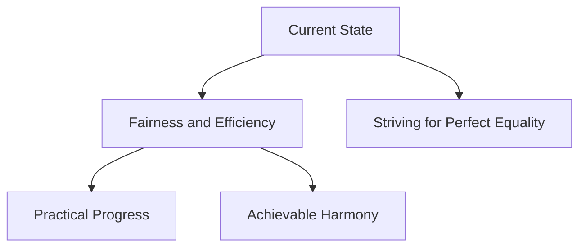

## Introduction

In the ongoing pursuit of a better world, I've come to recognize that the concept of "equality" often entails more complexities than meets the eye. As Albert Einstein aptly stated:

> "Perfection of means and confusion of ends seem to characterize our age."

## Rethinking Perfection

My definition of "perfection" goes beyond merely managing intricate tasks. It's rooted in establishing fairness and efficiency without succumbing to exhaustion. Imagine navigating a labyrinth, seeking the most efficient path without losing our way or becoming overwhelmed by the journey.

## A New Focus

I've shifted from fixating solely on attaining a flawless equilibrium. Instead, I'm embracing equilibrium through practicality and reason. As Steve Jobs wisely pointed out:

> "Simple can be harder than complex: You have to work hard to get your thinking clean to make it simple."

## Embracing Imperfections

This pursuit involves embracing the best form of "imperfection." Recognizing that progress doesn't necessarily equate to unwavering equality, it's about discovering a rhythm that serves us well. As we journey forward, each step takes us closer to a world that is more balanced and judicious – a world uncomplicated by unnecessary intricacies.

## Exploring Related Topics

In our exploration of balanced progress, I delve into two complementary concepts that provide deeper insights into our evolving world:

### "Perfectize the Imperfection: Chasing the Best Version of 'Imperfect'"

In this article, I uncover the power of strategic imperfections and how they contribute to growth and impactful results. It's not about cutting corners or settling for less; rather, it's about the insightful discernment of when striving for perfection adds genuine value and when it simply chases an unattainable illusion. The brilliance often surfaces not from flawless execution, but from effective imperfection.

### "Planning Unplanned: The Magic of Fluid Tech Strategy"

"Planning Unplanned" challenges traditional roadmapping conventions, highlighting the importance of adaptability and embracing unpredictability within structured frameworks. Bruce Lee's wisdom, "You must be shapeless, formless, like water," beautifully captures the essence of adaptability. The article delves into how embracing unpredictability within structured frameworks can lead to the magic of fluid tech strategy.

These topics collectively offer fresh perspectives on our pursuit of progress in a world that's ever-evolving and complex.

## Visualizing the Journey

To illustrate this concept further, consider the following schema:

## Moving Forward

Our commitment to fairness and practical progress leads to a balanced and rational world – free from unnecessary complexities.
