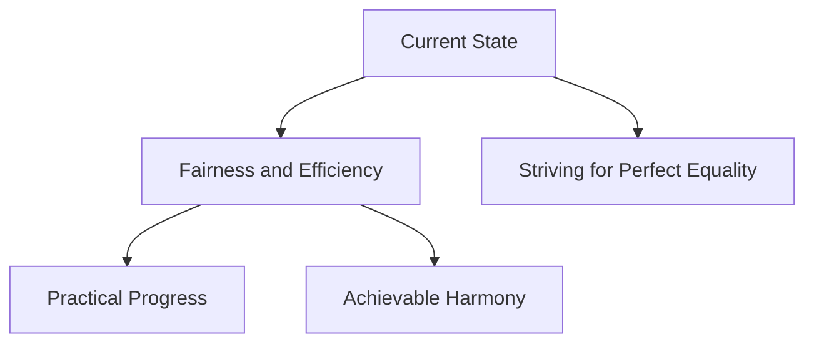

## Introduction

In the pursuit of a better world, "equality" can be more complicated than it seems. Albert Einstein noted:

> "Perfection of means and confusion of ends seem to characterize our age."

## Rethinking Perfection

My definition of "perfection" goes beyond complex tasks. It's about fairness and efficiency without exhaustion. Picture navigating a maze for the best path.

## A New Focus

I've shifted from obsessing over perfect balance. Instead, I aim for equilibrium through practicality and reason. As Steve Jobs said:

> "Simple can be harder than complex: You have to work hard to get your thinking clean to make it simple."

## Embracing Imperfections

This pursuit is about embracing the best form of "imperfection." Recognizing progress doesn't mean strict equality. It's about finding a rhythm that works.

## Visualizing the Journey

Consider this schema:

## Moving Forward

Our commitment to fairness and practical progress leads to a balanced and rational world – free from unnecessary complexities.
