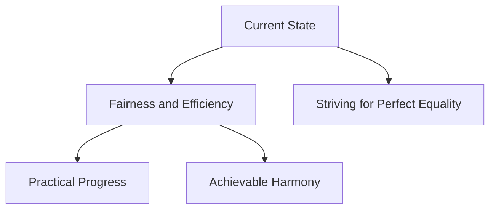

## Introduction

In my ongoing pursuit to create a better world, I've come to recognize that the concept of "equality" often entails more complexities than meets the eye. As Albert Einstein aptly stated:

> "Perfection of means and confusion of ends seem to characterize our age."

## Rethinking Perfection

My definition of "perfection" goes beyond complex tasks. It's about fairness and efficiency without succumbing to exhaustion. Picture navigating a maze for the best path.

## A New Focus

I've shifted from obsessing over perfect balance. Instead, I aim for equilibrium through practicality and reason. As Steve Jobs said:

> "Simple can be harder than complex: You have to work hard to get your thinking clean to make it simple."

## Embracing Imperfections

This pursuit is about embracing the best form of "imperfection." Recognizing progress doesn't mean strict equality. It's about finding a rhythm that works.

## Exploring Perfect Imperfection

In a related exploration, I delve into the concept of "Perfectize the Imperfection: Chasing the Best Version of 'Imperfect.'" I discuss how mastering the art of compromise is a superpower in our quest for progress. The article delves into the symbiotic relationship between perfectionism and procrastination, the engineer's paradox, and how embracing strategic imperfections can lead to growth and impactful results.

You can read the full article [here](./posts/perfect-imperfection.md).

## Visualizing the Journey

To illustrate this concept further, consider the following schema:

## Moving Forward

Our commitment to fairness and practical progress leads to a balanced and rational world – free from unnecessary complexities.
