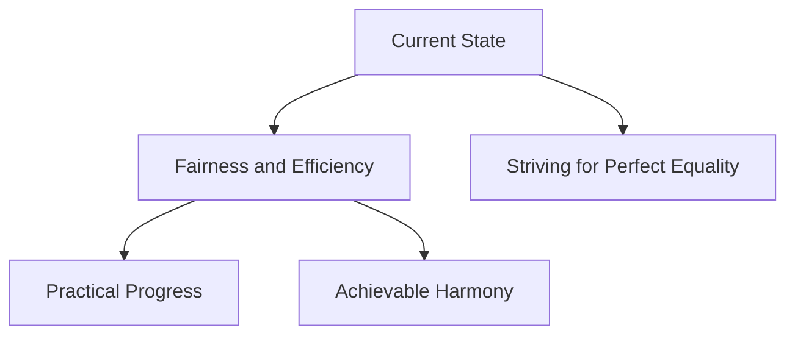

In the ongoing pursuit of a better world, I've come to recognize that the concept of "equality" often entails more complexities than meets the eye.

> "Perfection of means and confusion of ends seem to characterize our age." - Albert Einstein

## Rethinking Perfection

My definition of "perfection" goes beyond managing intricate tasks. It's rooted in establishing fairness and efficiency without succumbing to exhaustion. Imagine navigating a labyrinth, seeking the most efficient path without losing our way or becoming overwhelmed by the journey.

In the spirit of this pursuit, I find inspiration in the concept of ["Perfectize the Imperfection: Chasing the Best Version of 'Imperfect'"](), where I explore the power of strategic imperfections contributing to growth and impactful results.

## A New Focus: Embracing Practicality and Reason

While the quest for perfect equality is admirable, I've discovered that it can sometimes lead us down a convoluted path. Rather than aiming for an elusive equilibrium that may never materialize, I've embraced a new focus – one that centers around practicality and reason.

Consider this: Complexity often masks itself as sophistication, but true sophistication lies in simplicity. Striving for perfect equality in every endeavor can lead to unnecessary intricacies that drain our resources, both in terms of time and energy. The pursuit of an unreachable utopia of equal outcomes can inadvertently divert us from the more pressing need for real-world solutions.

This shift towards practicality and reason doesn't mean forsaking the ideals of fairness and progress. Instead, it involves a strategic evaluation of what constitutes true progress. It's about allocating our efforts wisely, channeling our energy into areas where it can make the most significant impact. The notion of a harmonious world becomes less about a stringent balance of every factor and more about recognizing that progress can manifest in varied forms.

## The Complexity of Definitions

Moreover, different definitions of equality can make it even more challenging to pursue a singular vision of perfect equality. With varying perspectives on what constitutes fairness and balance, the pursuit can become a maze of conflicting ideals, rendering it an even more elusive and potentially lost cause.

Each person, community, and culture might interpret equality differently, based on their unique experiences and contexts. One person's version of equality might be another's inequity. This multiplicity of interpretations magnifies the complexity of the pursuit and casts doubts on the attainability of a universal standard of perfect equality.

However, acknowledging the diversity of perspectives doesn't negate the importance of striving for fairness and progress. Rather, it invites us to redefine our objectives and approach. Instead of being fixated on a rigid destination of perfect equality, we can focus on fostering a more inclusive dialogue that accommodates various definitions of fairness. This approach allows us to create a space where collaboration, understanding, and mutual respect thrive.

## Embracing Imperfections

This pursuit involves embracing the best form of "imperfection." Recognizing that progress doesn't necessarily equate to unwavering equality, it's about discovering a rhythm that serves us well. As we journey forward, each step takes us closer to a world that is more balanced and judicious – a world uncomplicated by unnecessary intricacies.

Sometimes, I imagine going into the future for 10 years and compare how much I would be happy if:

1. I continue pushing for equality.
2. I just consider that it was fair enough and push forward.

I usually imagine being more than satisfied by choosing simple fairness. Interestingly, I also imagine providing actually more than equality, like a win-win or 1+1=3. This is because the time I kept by choosing fairness allowed me to create more collaboration with other actors, which at the end provides more value for everyone.

In this pursuit of embracing imperfections, I'm reminded of ["Planning Unplanned: The Magic of Fluid Tech Strategy"](), where I challenge roadmapping conventions and highlight adaptability in structured frameworks.

## Visualizing the Journey

To illustrate this concept further, consider the following schema:

## Moving Forward

Our commitment to fairness and practical progress leads to a balanced and rational world – free from unnecessary complexities.

> "Inequality can have a bad outcome, but equality, for its own sake, is a bad starting point." - Nicholas Nassim Taleb
