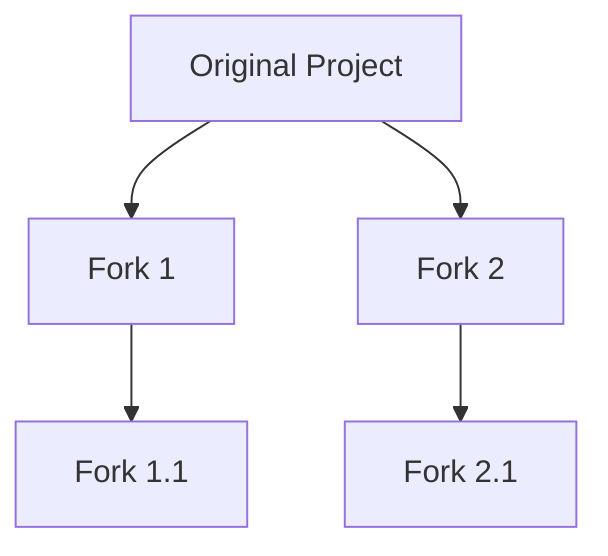

## Introduction: Forkability - The Heart of Software Evolution

In the realm of software, survival hinges not on sheer power or flawlessness, but on forkability—the ability to be cloned and transformed. This is software's secret to adaptability, evolution, and ultimately, survival. Forkability isn't just a technical feature; it's the lifeline that enables software species to thrive in the dynamic ecosystem of digital innovation.

## The Many Facets of Forkability

Forkability, a term encompassing various aspects of software development, is like a multifaceted gem. Each term - Adaptability, Modifiability, Evolutionary Potential, Branchability, Iterability, Extensibility, Progressive Enhancement, Versatility, Malleability, Transformability - highlights a unique aspect of software's resilience and vitality.

## Forkability: The Balancing Act of Software Survival

Software, like many species in the wild, survives through a delicate balance between striving for perfection and maintaining forkability. It's not about creating a flawless product but about developing something good enough and adaptable. This balance allows software projects to evolve and flourish over time, securing their legacy and relevance.


*Diagram: The branching nature of software through forkability.*

## Forkability: Catalyst for Evolution

Forkability is the driving force behind software evolution. It allows projects to inherit strengths from predecessors while iterating and improving upon them. This process fosters not just incremental enhancements but also the emergence of innovative solutions.

## The Twin Challenges of Forkability

1. **Technical Challenges**: Achieving forkability requires thoughtful design, ensuring interoperability, and considering migration paths. Without addressing these, a project risks becoming obsolete in favor of newer forks.

2. **Fairness Challenges**: Balancing community empowerment and fairness in a fork is crucial. This is particularly true in blockchain and DAOs, where licensing and tokenomics play pivotal roles in managing transitions.

## Forkability in Blockchains and DAOs

In the context of blockchains and DAOs, forkability is essential. These platforms are designed for longevity and often resist direct mutations. Forkability ensures that they can evolve and adapt over time, reflecting the changing needs and aspirations of their communities.

```go
type Forkable interface {
    Fork() (Forkable, error)
}
```
*Code Snippet: A simple interface illustrating the concept of forkability in programming.*

## Conclusion: The Imperative of Embracing Forkability

Forkability is more than a feature; it's a fundamental aspect of software's evolution and longevity. It fosters a healthy, competitive environment, ensuring the endurance and growth of ideas and projects. As creators and custodians of the digital world, our focus should not be on achieving perfection but on fostering adaptability and resilience through forkability. It's an opportunity for endless growth, innovation, and evolution.

> _"The only constant in life is change."_ - Heraclitus

*Share your thoughts on how forkability has impacted your projects or join our community to stay updated on more insights into software development.*
