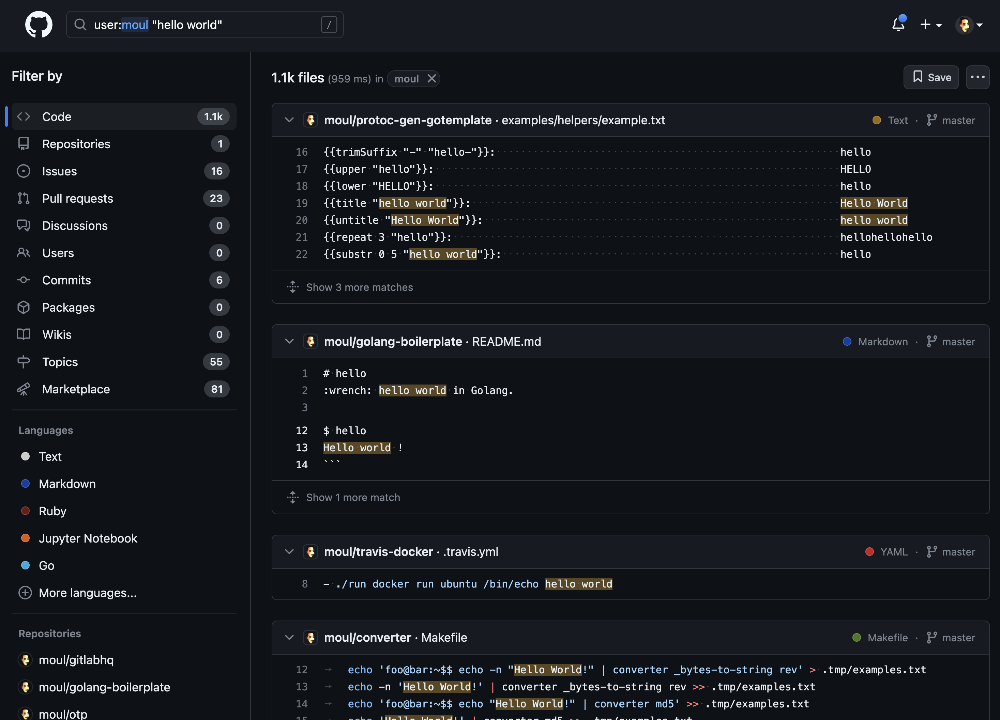

```go
package hello

// Hello returns a simple greeting.
func Hello() string {
    return "Hello, World!"
}
```

## Introduction

"Hello, World!" – a phrase so simple, yet profoundly symbolic in programming. It's the first step into the realm of code, a rite of passage for every programmer.

## The Power of Simplicity

With just a handful of characters, this unassuming greeting carries a universe of significance. It represents the moment when abstract concepts metamorphose into tangible creations, when lines of code begin to shape reality. This power of simplicity is akin to how the most profound ideas can often be expressed in the simplest forms.

Consider the elegance of a sunrise or the purity of a single note in a musical composition. In the same vein, "Hello, World!" serves as a portal that transcends complex languages, libraries, and frameworks. It cuts through the noise and lays bare the core essence of programming – communication.

The simplicity of "Hello, World!" is a reminder that technology, at its core, is a tool for communication, for connecting ideas to reality. It's a humble opening that invites us to learn the language of machines and weave our intentions into the fabric of the digital world.

## The Achievement of "Hello, World!"

Creating a "Hello, World!" program in a new language is a significant achievement.
It means that the language, parser, and compiler are all working correctly.
It also means that the conventions of the language have been established and that the language has been adopted by a community of developers.
This simple program is a testament to one of humanity's greatest inventions - language and communication.

## Igniting Enthusiasm, Embracing the Future

Beyond its surface, "Hello, World!" captures exploration and discovery. It's where curiosity meets practical coding, bridging the gap between novices and experts, signifying endless possibilities and ongoing learning.

I personally see "Hello, World" as an energic introduction. Each time you start a program with this, you feel the urge to go forward. The spark of "Hello, World!" ignites a passion that propels us to explore, innovate, and seek new challenges.

Whether you're a seasoned coder reminiscing or a newcomer taking your initial plunge, "Hello, World!" is a reminder that every masterpiece starts with a single stroke. It's an open door to innovation, a tribute to persistence, and a reminder that even grand achievements begin humbly.

> "Programming is not just about writing code; it's about crafting the future." - Linda Liukas

## Beyond Binary

In my blog post ["Beyond Binary"](), I explore the convergence of language and technology, the cultural impact of code, and the power of language in shaping humanity's digital journey.

Just as "Hello, World!" serves as a stepping stone into the world of programming, "Beyond Binary" delves deeper into the intersection of technology and humanity.

## A Growing Footprint

You might be surprised to learn that the influence of "Hello, World!" reaches beyond individual projects. Take my own GitHub repositories, for instance. A simple search reveals over 1000 files containing references to "hello world" in my latest commits alone. This count doesn't even include my initial commits, which often feature a "hello world" as a starting point, only to be removed later.

[](https://github.com/search?q=user%3Amoul+%22hello+world%22&type=code)

## Parting Wisdom

Embrace "Hello, World!" as more than code; it's a mindset nurturing creativity, resilience, and shaping the future.

> "I think everybody in this country should learn how to program a computer because it teaches you how to think." - Steve Jobs
