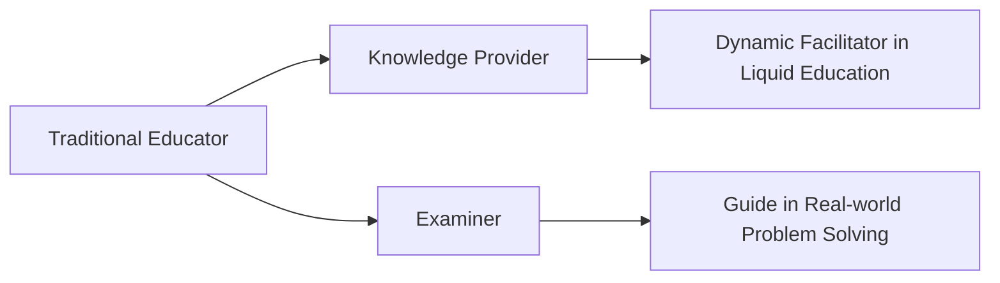

## From Solid Ground to Flowing Waters

Traditional educational systems often feel like solid blocks — rigid, inflexible, and hard to reshape. However, as the tides of the digital age rise, propelled by Artificial Intelligence (AI), we find ourselves yearning for a more fluid approach. Enter Liquid Education: a concept built on adaptability, choice, and dynamic co-creation.

## The Solid Curriculum: AI's Playground

Within the walls of structured and unyielding curricula, AI thrives, overshadowing the traditional human educator. The rigidity of our classical models, while easy for machines, lacks the dynamism needed for the modern human learner.

## Liquid Education in Action

Liquid Education is no mere buzzword; it's a transformative shift:

- **Choose Your Stream**: Just as water flows where it wishes, learners pick topics, explore them at their own pace, and mix disparate subjects to form a unique educational cocktail.
  
- **Pooling Resources**: Sites like **Khan Academy** or **Coursera** are reservoirs where learners can both absorb and contribute, fostering an ecosystem of shared knowledge.

- **Dynamic Peer Groups**: Just as water droplets come together, learners form temporary groups based on interests, challenges, or projects, collaborating intensively and then reforming with new peers as interests evolve.

- **Connective Currents**: Platforms such as **GitHub** become the rivers connecting different pools of knowledge, enabling seamless integration and evolution of learning materials.

## Building the Reservoirs of Liquid Education

1. **Adaptable Learning Paths**: Wave goodbye to fixed syllabi. Welcome learning experiences that shift based on interests, global events, or emerging technologies.
  
2. **Dive into Digital Platforms**: Harness platforms that facilitate flow, allowing learners to dive in, contribute, and then flow on to new challenges.

3. **Fluid Facilitation**: Educators evolve from static knowledge providers to dynamic facilitators, guiding learners as they navigate through the currents of knowledge.

4. **Assessment Reimagined**: Traditional exams become outdated. Instead, peer-reviewed projects, real-world problem-solving, and digital content creation form the new benchmarks.

5. **Cross-Current Collaborations**: Encourage learners from diverse backgrounds to come together, blending their unique perspectives and creating a richer learning experience.

6. **AI as the Undercurrent**: AI becomes a tool that supports the flow, guiding learners to resources, filling knowledge gaps, and even suggesting potential peer collaborators.

Certainly! Here's a mini-section to incorporate into the blog post, taking advantage of the 4th Mermaid graph:

---

## The Educator's Evolution in the Fluid Landscape

In the framework of Liquid Education, the role of the educator witnesses a profound transformation. Gone are the days when educators were mere vessels of knowledge, expected only to deliver and examine. In the fluid learning environment, they are not just facilitators, but dynamic guides adapting to the ever-evolving currents of knowledge.

As depicted above, the transition from a traditional educator to a dynamic facilitator in Liquid Education is vital. Their primary role is no longer just about providing knowledge but curating an experience. Instead of examining using old metrics, they guide learners in real-world problem-solving, ensuring that the learning is relevant, practical, and dynamic.

This shift is more than just a change in responsibilities. It's about embracing the spirit of Liquid Education, ensuring that as the waters of learning shift and flow, the educator is right there, navigating alongside the learners.

## The Flow Forward

Liquid Education isn't a mere adaptation; it's a radical reimagining of what learning can be. It emphasizes flexibility over rigidity, dynamism over stagnation, and collective co-creation over isolated study.

The future is fluid, and with Liquid Education, we can ride the waves of change, ensuring that every learner, irrespective of age, background, or location, finds their unique flow.

---

Liquid Education paints a vision of a world where learning isn't constrained by traditional boundaries. Instead, it flows, adapts, and reshapes, just as water does — ever-changing, ever-evolving. The future is not just about learning; it's about flowing.
