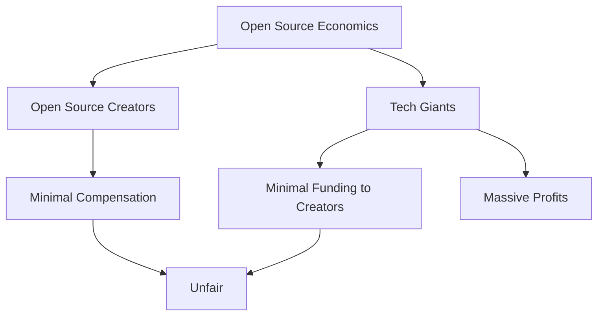

When you hear the term 'open source', what comes to your mind? For some, it's a digital realm of collaboration and innovation. For others, it’s an all-you-can-eat buffet. And yet, for a few visionaries, it’s the foundation of the future. Let's explore these perspectives.

## Not Just a Static Achievement

The beauty of open-source is that it's ever-evolving. While some see it as a final product, static and unchanging, they miss its dynamic nature. Just as Rome wasn't built in a day, the open-source world we see today is the result of countless contributions over the years. And it doesn’t stop here. With continuous inputs and innovations, tomorrow's open-source can make today's versions seem rudimentary.

## The 'Open Bar' Misconception

There's a segment of users who treat open-source as if it's an open bar — taking all they can without giving back or even acknowledging the hard work behind it. This mentality isn't just harmful; it devalues the countless hours that developers pour into their projects. But you know what? Users can become contributors! It's a community where today's user can be tomorrow's innovator.

And then, there’s the roadmap. Open source isn’t driven by its users; it’s driven by its maintainers. The journey of the project isn’t determined by the whims of the masses but by the vision of its caretakers. Oh, and do not forget that open-source is also about forking, which is not just a right but a tremendous power to take projects in new directions!

## Quality Over Cost: Debunking the Myth

The beauty of open-source lies in the perception of 'free access', but in actuality, this free access presents a vast reservoir of value. It’s essential to distinguish between 'free to use' and 'free to produce'. While many end-users enjoy open-source software without incurring costs, there's an immense, often unrecognized, value provided by the developers behind the scenes.

However, the economics of open-source is inherently skewed. While it gifts unparalleled value, the rewards are unfairly distributed. Many titans of the tech industry rely heavily on open-source software created by developers who are often unpaid or undercompensated. These tech giants derive tremendous value and profits from these projects, yet the original creators see only a fraction, if any, of this monetary appreciation.

## DAOs, Self-Organized Communities, and the Future

Drawing a parallel, open-source communities can be likened to DAOs (Decentralized Autonomous Organizations) in many ways. Both thrive on transparency, trust, and collaboration. Both are driven by community proposals, aiming to reach a consensus for the betterment of all. If DAOs are reshaping the future of organizational structures, open-source communities are pioneering the future of collaborative innovation. Moreover, the trajectory of open-source communities often mirrors the progressive decentralization seen in DAOs. Many projects start with one or two authors, scale with contributors, and elevate those contributors to maintainers, considering users as integral parts of the ecosystem.

## The Open Source Happy Hour

Imagine an era where open-source isn't just about lines of code and debugging, but about community, celebration, and dreams. What would it look like? How would you envision a time when open-source contributors come together, not just to code, but to celebrate, ideate, and dream?

---

**In Conclusion**

Open source isn't just a repository of codes; it's a philosophy, a community, and a movement. While it's essential to celebrate how far we've come, it’s equally vital to address its pitfalls and to continuously push its boundaries. Here's to those who understand its value, to those who dream of its potential, and to those who are crafting its future. Open-source is strikingly similar to DAOs and blockchains, but it currently lacks monetary motivation. This is precisely what I'm exploring at Gno.land, with the "proof of contributions", which could pave the way for the next generation of open-source I envision. The best thing you can do as a user? Learn coding and become a contributor, stepping alongside the very creators of your favorite tools.
