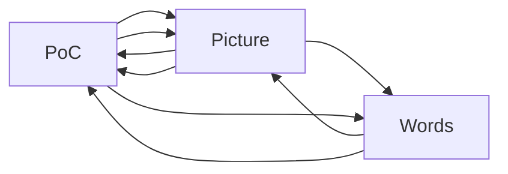

> 💻>🖼️>🔤

Every now and then, a simple statement can eloquently condense the essence of complex subjects. Today, I want to talk about two such statements that elucidate the value of visual representation and practical demonstrations.

## A Picture is Worth a Thousand Words. 🖼️>🔤

This age-old adage posits that complex ideas can often be conveyed effectively and efficiently through a single still image. A picture can express a situation or concept that would require a myriad of words to explain. It appeals to our visual nature, communicates instantly, and leaves a lasting impact.

In the realm of software development, a well-crafted diagram can communicate complex systems and workflows with lucidity. App architecture, data flow diagrams, or a simple wireframe; a picture can make the difference between clear understanding and utter confusion.

## A Proof of Concept is Worth a Thousand Pictures. 💻>🖼️



While a picture can convey a thousand words, a Proof of Concept (PoC) can be superior, as it directly showcases an idea's feasibility. It's the working model that acts. It breathes life into the static blueprints.

In the software world, a PoC communicates the practicality and potential of an idea far more effectively than theoretical documents or exhaustive diagrams ever could. It provides tangible evidence of what can be achieved, paving the way for stakeholder trust and further investment. Interestingly, it also uncovers unforeseen issues early on, saving time, effort, and cost in the long run.

## Choosing the Right Communication Tool: Words, Pictures, or PoC?

While the essence of both these statements remains timeless, what's impactful to understand is the importance of context. Knowing when to use a picture, and when a PoC would be more suitable, requires wisdom. Use pictures to simplify and communicate complex ideas. Use a PoC to demonstrate feasibility and garner buy-in.

Going forward, I challenge you to think about how these tools could be employed in your project, tasks, or even in your daily life. After all, why use a thousand words when you could use a picture? Or a thousand pictures when you can use a good Proof of Concept?

> A picture is worth a thousand words 🖼️>🔤.
> A PoC is worth a thousand pictures 💻>🖼️.

Remember to choose wisely and use these powerful tools strategically to communicate more effectively.

## Fun Mixes and Recursive Wonders: Picture of a PoC and PoC of a Picture

Let's delve a bit deeper and play around with how we can mix and match these concepts. There can be times where instead of making a picture to illustrate a complex description, you instead create a picture of a PoC. Or instead of a PoC to illustrate the feasibility of an idea, you have a PoC solely aimed at creating a picture. Sounds interesting? Let's explore:

**A Picture of a PoC 🖼️>💻**

Imagine you have a complex proof of concept, bristling with intricate details. You could create a picture to represent the flow and functionality of the PoC. This could be a flowchart showing how different components interact, or a conceptual layout of the PoC module. Visualizing the PoC in this way can serve as a handy reference guide, aiding understanding and navigation.

**A PoC to Create a Picture 💻>🖼️**

Here's another fun idea. Suppose you're given a challenge to represent some complex data visually. You could create a PoC whose sole purpose is to generate a picture. This could be a PoC that generates a graph, a visual dashboard, or even a simple ASCII art visualizer. The PoC, in essence, becomes a tool to create pictures rather than being the end product itself.

And just to mix things up even more, how about a recursive picture of a PoC of a Picture of a PoC? The possibilities are endless, and that's the beauty of it!

Not only does this let you have a bit of fun while working, but it also opens up whole new ways to conceptualize, visualize and understand complex ideas and problems.
So the next time you're grappling with a gnarly problem, why not try one of these fun mixes?
After all, isn't change and experimentation the soul of innovation?

> "The trouble with programmers is that you can never tell what a programmer is doing until it’s too late." - Seymour Cray
