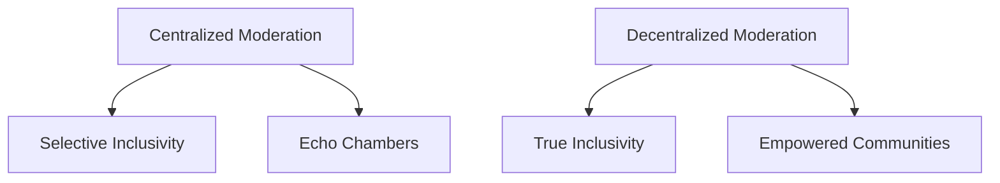

## The Paradox of Inclusivity

The digital realm is ablaze with the promise of **inclusivity**. From social media platforms to community forums, everyone's championing the cause. But often, beneath this veneer of inclusivity, lies a stark reality: controlled narratives and silenced dissent.

As someone deeply involved in tech, I was intrigued. I wanted to know if there's more than meets the eye. And oh, there was!

> "Without deviation from the norm, progress is not possible."  
> — Frank Zappa

## Decentralization: The Antidote?

That's when I stumbled upon the realm of **decentralized moderation**. Imagine a system where there isn't a single authority dictating the narrative. Instead, the power returns to the community.

A decentralized approach promises fairness, but implementing it isn't child's play. The tech has to be robust, sure. But the bigger challenge? Ensuring everyone has an equal say and curbing misuse.

> "The greatest enemy of freedom is a happy slave."  
> — Marie von Ebner-Eschenbach

## Words Matter: Rethinking "Inclusive" Terminology

One striking revelation was how some supposedly inclusive terms were, unintentionally, sidelining people. Terms like "atheist" or "no controversial" seemed exclusionary, even if inadvertently.

To cultivate a truly inclusive environment, our language must evolve. Neutral terms like "Agnostic" or "Secularism" resonate with a wider audience, fostering a sense of belonging.

> "Moderation in temper is always a virtue; but moderation in principle is always a vice."  
> — Thomas Paine

## Looking Forward: Fostering Genuine Conversations

We're at a unique juncture in the evolution of online communities. While the quest for inclusivity has begun, the path is riddled with challenges. But therein lies the beauty.

By questioning the status quo, by daring to reimagine systems, and by pushing the boundaries of what's possible, we inch closer to an online world that truly celebrates diversity.

As we embark on this journey, let's commit to conversations that embrace, that challenge, and that inspire. For in these conversations lies the hope for a genuinely inclusive digital realm.

> "Censorship reflects a society's lack of confidence in itself."  
> — Potter Stewart
