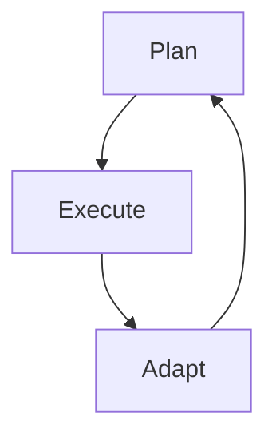
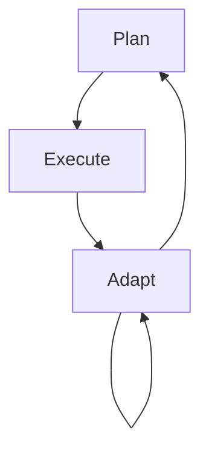

Today I want to share something a tad controversial—especially in our Scrum-certified era.
Yep, it's about shaking up the traditional roadmapping conventions.

"Planning Unplanned" delves into the art of embracing unpredictability within structured frameworks, highlighting the paradoxical need to both anticipate and adapt to the unexpected.

---

> **Bruce Lee**: "You must be shapeless, formless, like water. When you pour water in a cup, it becomes the cup. When you pour water in a bottle, it becomes the bottle. When you pour water in a teapot, it becomes the teapot. Water can drip and it can crash. Become like water my friend."

This quote beautifully captures the essence of adaptability.
In the realm of project management and planning, we must be like water, taking the shape of our environment and challenges.

## Quotes to Set the Mood

First, some food for thought from some really cool people:
  
> **Charles Darwin**: "Survival of the fittest? More like survival of the most adaptable."

> **Mike Tyson**: "Got a plan? Wait till life punches you in the face."

These snippets aren't just catchy.
They're a shout-out to the art of adaptability.
Whether it's nature, combat, or tech, the ability to flex and adapt is golden.

## Here’s the Deal: Why Over-Planning Isn’t the Way

- **Drowning in Details**: More details don't always mean better clarity. Sometimes, they blur the bigger picture and the exciting turns a project can take.

- **Embrace the Unknown**: Predicting every twist and turn? That's a wild goose chase. The real magic lies in dancing with the unexpected.

## Sprinting: Not Always the Winner’s Move

Look, Scrum and sprints have their charm. But binding ourselves to super rigid timelines can choke creativity. And let's be honest, how often does everything go exactly as planned?

## Don’t Get Lost in the Tech Lingo

- **Board Battles**: Ever gotten lost in a sea of tech jargon during brainstorming sessions? Implementation specifics have their time and place. But starting with them? That’s a creativity-killer.

- **Features First, Jargon Later**: Instead of delving into the “hows” right off the bat, focus on the “whats”. Say, “This service will handle user authentication” rather than deep-diving into the middleware specifics.

## The Real MVP: Adaptive Planning

Think of it as an agile dance:

`Plan -> Execute -> Adapt -> Repeat.`

Sometimes, you might find yourself in this loop:

`Plan -> Execute -> Adapt -> Adapt -> Adapt -> Repeat.`

## Broad Strokes First: The Monorepo Way

Starting with a broad view and refining as we go is smart.
As we get the hang of things, we can sift out the gems and build upon them.
It's about evolving organically.

## Vision Over Tiny Specs

A shared vision can act like a beacon.
It guides and aligns everyone—from devs to designers.
Details are good, but the bigger picture? That’s gold.

## Why Fluid Roadmaps are the Future

- **Adapting > Predicting**: The tech world’s fast-paced. Predicting everything's tough. But adapting? That's doable.

- **Guides, Not Chains**: Roadmaps should inspire and guide, not shackle us.

# Wrapping Up

Roadmapping isn't about predicting the future.
It's about gearing up for it.
This might sound counterintuitive, especially when everyone's raving about Scrum certs.
But sometimes, flowing like water is the real power move in tech.
