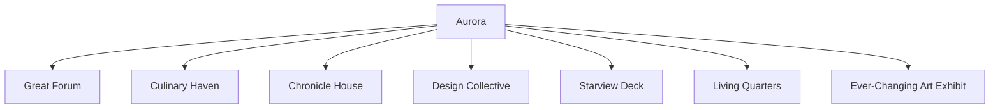
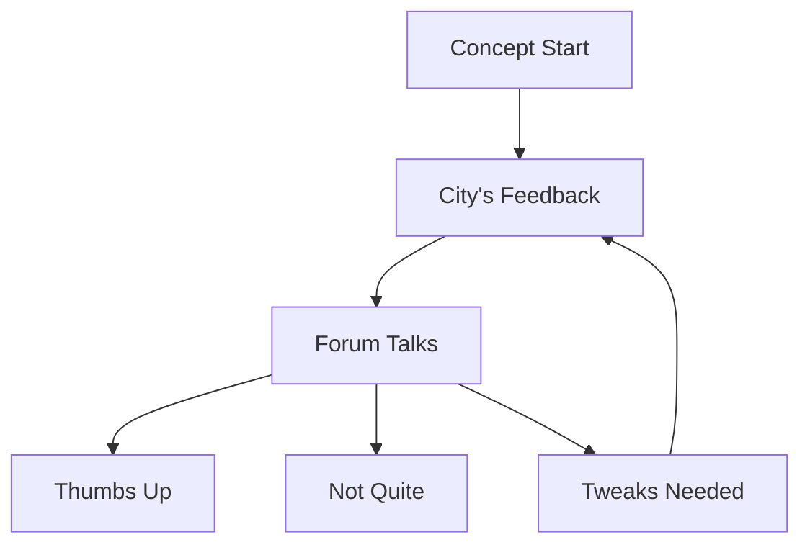

## Chapter One: Greeting the Dawn in Aurora

I remember the morning Aurora greeted me with sunlight that felt like a gentle embrace. This city, every inch of it, had 'open' written all over.

Walking through its streets, I felt like I was Evelyn, a character in a novel, taking in stories of unity, fresh ideas, and shared dreams. Buildings varied – some looked like they touched the clouds, others felt cozy and welcoming. But they all had one thing in common: open blueprints for anyone to see, critique, or appreciate.

The heart of Aurora was alive! Kids played and painted stories on the 'Ever-Changing Art Exhibit' that stood grandly in the town plaza. Those paintings changed daily, mirroring the city’s lively spirit.

My wristwatch buzzed, pulling me back from my daydream. To my delight, the Design Collective picked my garment design as the week's favorite! That’s Aurora for you - a place where everyone gets a say, and every voice counts.

The hustle and bustle at the Great Forum hinted at something big. Turns out, the day's chatter was about adding more green to Aurora. Everyone, from kids to grandparents, shared their colorful visions.

Hunger pangs led me to the Culinary Haven. The scents were a treat! The best part? Recipes here weren’t set in stone; they evolved with feedback and experimentation.

I ended my day at the Collaborative Chronicles, a place where stories weren't just read but crafted together. I found myself lost in tales that felt different with every reader’s touch.

As day turned to evening, a thought struck me: Aurora, with its open-hearted spirit, made dreams - big or small - feel so reachable.

## Chapter Two: Afternoon Musings

The afternoon sun had a different tale to tell. Aurora wasn't just about bright ideas and shared visions; it had its share of dilemmas too.

I remember approaching the 'Open Blueprint Hub.' Usually buzzing with creativity, it was a debate ground that day. A building plan, while groundbreaking, split opinions. The beauty of an open society was also its challenge: melding countless dreams into one.

The Culinary Haven, a place of comfort, threw me a curveball. I overheard folks missing a dish that got sidelined for modern flavors. It made me wonder: How do you balance the old with the new?

While walking to the Great Forum, a crowd caught my attention. The hot topic? A transport revamp. Sure, it promised speedy commutes, but at the cost of some cherished community spots. It felt like walking a tightrope between the future and memories.

And then there was the young artist at the Art Exhibit, looking at his masterpiece being painted over. In a city that valued fresh ideas, sometimes personal work had a shorter spotlight.

My wristwatch buzzed again: feedback on my design. While some loved it, others suggested tweaks. It was bittersweet. Aurora was ever-changing, keeping you on your toes.

I ended my day on the Starview Deck, taking in the city's beauty and musing about its intricacies. I cherished Aurora's openness, but today was a reminder of the balancing act it entailed.

A thought stayed with me: In a place like Aurora, where everyone's a painter, how do you make sure your brushstroke stands out?

---

**To be continued...**
